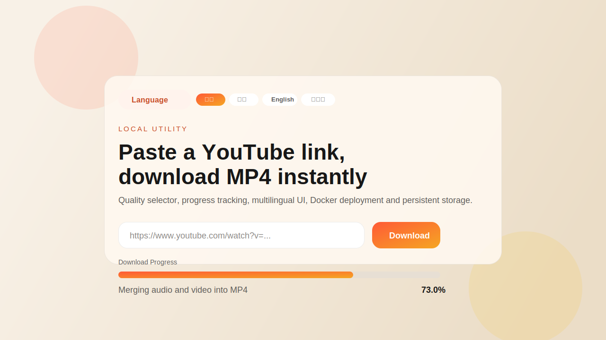

# YouTube to MP4 Downloader

これはローカル環境または Docker 上で動作する YouTube ダウンロードと音声文字起こしツールです。

- Docker デプロイ
- MP4 と字幕の永続保存
- `faster-whisper` による文字起こし
- 画質選択
- ダウンロードと文字起こしのリアルタイム進捗表示
- 繁体字中国語、簡体字中国語、英語、日本語 UI
- HTTP API、Swagger、CLI、E2E テストスクリプト

> 保存権限のあるコンテンツのみをダウンロードし、YouTube の利用規約と著作権ルールを守ってください。

## プレビュー



## 主な機能

- YouTube の `watch`、`youtu.be`、`shorts`、`embed` URL に対応
- `最良の画質`、`1080p`、`720p`、`360p` を選択可能
- `ダウンロード` または `ダウンロードして文字起こし` を実行可能
- ダウンロード中と文字起こし中に進捗と状態を表示
- ローカル MP4 の再生、元の YouTube ページを開く、生成ファイルのダウンロードに対応
- `txt`、`srt`、`vtt`、`json` の文字起こし出力を生成
- `ffmpeg` が利用可能な場合は MP4 に結合して出力
- 右上のボタン列から UI 言語を切り替え可能
- ダウンロード動画、字幕、モデルキャッシュをコンテナ外に永続保存可能
- ログイン確認や bot 判定対策のために YouTube cookies を利用可能
- 他プラットフォームや AI Agent 向けの HTTP API を提供
- Swagger UI と OpenAPI JSON を提供
- `python3 cli.py` による CLI を提供
- `python3 scripts/e2e_api_test.py` による E2E テストスクリプトを提供

## 技術構成

- Python `Flask`
- `yt-dlp`
- `faster-whisper`
- `ffmpeg`
- YouTube JavaScript runtime 解析用の `nodejs`
- Docker / Docker Compose

## Docker ですぐに起動

このプロジェクトには以下が含まれています。

- `Dockerfile`
- `docker-compose.yml`
- 永続ストレージ設定
- cookies マウント設定
- STT 用の独立サービスコンテナ

起動方法：

```bash
docker-compose up --build -d
```

新しい Compose plugin を使っている場合：

```bash
docker compose up --build -d
```

起動後に以下を開いてください。

```text
http://127.0.0.1:5001
```

Swagger UI：

```text
http://127.0.0.1:5001/api/docs
```

## 永続保存

ダウンロードされた MP4、文字起こし結果、モデルキャッシュは次の bind mount を通してホスト側に保存されます。

```yaml
volumes:
  - ./video-storage:/data/downloads
  - ./transcripts:/data/output
  - ./models:/models/huggingface
```

これにより：

- コンテナ再起動後も動画が残る
- コンテナ再構築後も動画が残る
- 動画、字幕、モデルがコンテナ内部だけに閉じない

別のホストパスを使いたい場合は、たとえば次のように変更できます。

```yaml
volumes:
  - /Users/yourname/Movies/youtube-downloads:/data/downloads
```

文字起こし出力の既定値：

```text
./transcripts
```

Whisper モデルキャッシュの既定値：

```text
./models
```

## YouTube Cookies 設定

YouTube で `Sign in to confirm you're not a bot` のようなメッセージが出る場合は、Netscape 形式の cookies をエクスポートして次に配置してください。

```text
./cookies/youtube.txt
```

Docker では以下にマウントされます。

```text
/data/cookies/youtube.txt
```

補足：

- compose は cookies ディレクトリを読み取り専用でマウントします
- アプリは `yt-dlp` 実行前に cookies を書き込み可能な一時領域へコピーします
- コンテナでは `YTDLP_REMOTE_COMPONENTS=ejs:github` も有効です

## Agent API と Swagger

このプロジェクトは他プラットフォームや AI Agent 向けの API を提供します。

- `GET /api/health`
- `GET /api/capabilities`
- `POST /api/v1/downloads`
- `GET /api/v1/jobs/{job_id}`
- `GET /api/v1/videos`
- `POST /api/v1/transcriptions`
- `GET /api/v1/transcriptions/{job_id}`

関連ドキュメント：

- Swagger UI：`/api/docs`
- OpenAPI JSON：`/api/openapi.json`
- 詳細ガイド：[docs/AGENT_API.md](docs/AGENT_API.md)

## CLI

例：

```bash
python3 cli.py health
python3 cli.py capabilities --json
python3 cli.py videos --json
python3 cli.py download "https://www.youtube.com/watch?v=dQw4w9WgXcQ" --wait --json
python3 cli.py transcribe "example-video.mp4" --wait --json
```

## E2E テストスクリプト

API フロー全体を検証：

```bash
python3 scripts/e2e_api_test.py --base-url http://127.0.0.1:5000 --url "https://www.youtube.com/watch?v=89bhDV0FBSM"
```

概要だけ表示：

```bash
python3 scripts/e2e_api_test.py --base-url http://127.0.0.1:5000 --url "https://www.youtube.com/watch?v=89bhDV0FBSM" --summary-only
```

## ローカル開発

Docker を使わずに実行したい場合：

```bash
python3 -m venv .venv
source .venv/bin/activate
pip install -r requirements.txt
python3 app.py
```

その後、以下を開きます。

```text
http://127.0.0.1:5000
```

macOS で MP4 結合をより安定させたい場合：

```bash
brew install ffmpeg
```

## プロジェクト構成

```text
.
├── app.py
├── cli.py
├── Dockerfile
├── docker-compose.yml
├── docs/
├── docker/
│   └── stt/
├── requirements.txt
├── scripts/
├── static/
├── templates/
├── assets/
├── cookies/
├── video-storage/
├── transcripts/
└── models/
```

## 使い方

1. ブラウザでアプリを開きます。
2. YouTube 動画 URL を貼り付けます。
3. 希望する画質を選択します。
4. `ダウンロード` または `ダウンロードして文字起こし` を押します。
5. 画面上で進捗と状態を確認します。
6. 文字起こしを有効にした場合は、ダウンロード完了後に STT が自動で始まります。
7. 動画一覧から動画再生、元 URL を開く、MP4 ダウンロード、`txt` / `srt` / `vtt` / `json` の取得ができます。

## 補足

- `ffmpeg` がない場合は、直接取得できる形式にフォールバックします。
- `ffmpeg` がある場合は、分離された音声と映像を MP4 に結合できます。
- 初回の `faster-whisper` 実行時は `./models` にモデルをダウンロードし、その後はキャッシュを再利用します。
- 動画によっては、アカウント、地域、年齢制限、または bot 判定のために有効な cookies が必要になることがあります。

## ライセンス

このプロジェクトは MIT License で提供されています。詳細は [LICENSE](LICENSE) を参照してください。
